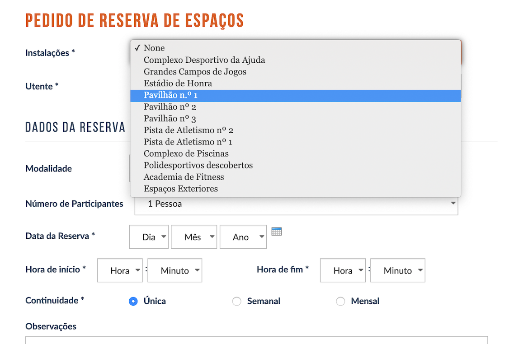

# futbladaj

👨‍💻 book a pitch from your terminal

## Motivation

Simple way to book a pitch in [Estádio Universitário de Lisboa](https://www.estadio.ulisboa.pt/webform/pedido-de-reserva-de-espacos) without having to fill in the form each time.



It also served as an exercise to learn a bit more about Rust. ⚙️

## Usage

```
futbladaj 0.1
Daniel Serrano <danieljdserrano@protonmail.com>
book a pitch from your terminal

USAGE:
    futbladaj [OPTIONS]

FLAGS:
    -h, --help       Prints help information
    -V, --version    Prints version information

OPTIONS:
    -a, --address <address>                Sets the booker's address (e.g., Old Street)
    -c, --config <FILE>                    Sets a custom config file (e.g., myconf.yml)
    -d, --day <day>                        Sets the day (1-31) for the booking (e.g., 1)
    -e, --email <email>                    Sets the booker's email (e.g., email@email.com)
    -E, --end-hour <end_hour>              Sets the end hour (0-24) for the booking (e.g., 23)
    -f, --fiscal-number <fiscal_number>    Sets the booker's fiscal number (e.g., 123123123)
    -m, --month <month>                    Sets the month (1-12) for the booking (e.g., 3)
    -P, --phone <phone>                    Sets the booker's phone number (e.g., +351 91 123 12 12)
    -p, --pitch <pitch>                    Sets the pitch for the booking (e.g., pav1) [possible values: ajuda, grandes,
                                           honra, pav1, pav2, pav3, poli]
    -C, --postcode <postcode>              Sets the booker's postcode (e.g., 1234-123)
    -S, --start-hour <start_hour>          Sets the start hour (0-24) for the booking (e.g., 22)
    -u, --username <username>              Sets the booker's username (e.g., John Doe)
    -y, --year <year>                      Sets the year for the booking (e.g., 2020)
```

We currently provide two ways to book a pitch. Either via a configuration file written in YAML or via CLI options.

### Use via YAML configuration file

You can use a given configuration file as follows. E.g., `config/booking.yml`:

```yaml
---
pitch: pav1
day: 1
month: 1
year: 2020
start_hour: 21
end_hour: 22
username: Jorge Jesus
email: email@email.com
fiscal_number: 123 123 123
phone: 91 123 12 12
address: Rua do Ouro
postcode: 1234-123
```

```sh
futbladaj -c config/booking.yml

# [SUCCESS] form submission successful
```

### Use via CLI options

Alternatively, you can also run it by specifying the various available configuration options:

```sh
futbladaj -p poli -a "Old Street" -d 1 -m 1 -y 2020 -e email@email.com -S 22 -E 23 -f 123123123 -C 1234-123 -u "John Doe" -P 911231212

# [SUCCESS] form submission successful
```

## Contributing

Bug reports and pull requests are welcome on GitHub at [`dnlserrano/futbladaj`](https://github.com/dnlserrano/futbladaj).

## License

    Copyright © 2019-present Daniel Serrano <danieljdserrano at protonmail>

    This work is free. You can redistribute it and/or modify it under the
    terms of the MIT License. See the LICENSE file for more details.

Made in Portugal :portugal: by [dnlserrano](https://dnlserrano.dev)
